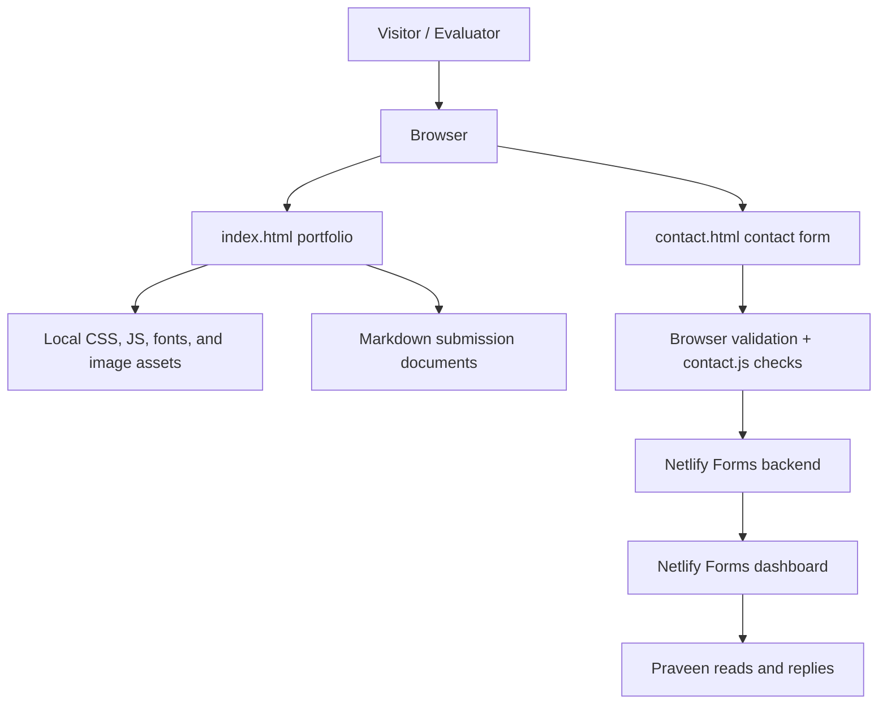

# K Praveen Kumar Portfolio

Live site: https://k-praveenkumar.netlify.app/

This repository contains K Praveen Kumar's personal portfolio website and final AI Fluency Track submission materials. The current production site is a lightweight static portfolio with a working contact form powered by Netlify Forms.

## Final Submission Index

- Project: this portfolio website
- Source code: `index.html`, `contact.html`, `styles.css`, `audit.css`, `app.js`, `contact.js`, `netlify.toml`, and `assets/`
- Documentation: this `README.md`
- V1/V2 evaluation: `docs/EVALUATION.md`
- Demo script: `DEMO_SCRIPT.md`
- Demo checklist: `DEMO_CHECKLIST.md`
- Retrospective: `RETROSPECTIVE.md`
- Hours log: `HOURS_LOG_TEMPLATE.md`
- Personal website: https://k-praveenkumar.netlify.app/
- Build-in-public post draft: `BUILD_IN_PUBLIC_POST.md`
- Published build-in-public post URL: https://x.com/Praveenk_23/status/2095714852358733921?s=20
- Demo video URL: https://drive.google.com/file/d/1tEoLV3U51kE-qnXcq-tQV3OwrOrrVe10/view?usp=sharing

## Project Overview

The project is a single-page personal portfolio for K Praveen Kumar, an ML Engineer Intern at FlyRank AI and BTech Artificial Intelligence student at Marwadi University. It presents Praveen's profile, experience, skills, credentials, contact links, and a working contact form in one professional home base.

The problem it solves is simple: professional proof is scattered across platforms such as LinkedIn, GitHub, resumes, and class deliverables. This site gives recruiters, mentors, and collaborators one stable place to understand who Praveen is, what he is building, and how to reach him.

The site is for recruiters, hiring teams, mentors, evaluators, collaborators, and Praveen himself as a public professional home base.

Main features:

- Premium dark-mode portfolio homepage
- Smooth-scroll navigation and lightweight reveal animations
- About, experience, capabilities, credentials, and future project sections
- Capstone / Featured Project section for the AI Fluency final submission
- External links to LinkedIn, GitHub, resume, and email/contact
- Netlify Forms contact page with required fields, honeypot spam field, and simple duplicate-submit protection
- Plain-language explainer of the backend/contact-form data flow
- SEO metadata, favicon placeholder, and Netlify security headers

## How AI Is Involved

AI tools, including ChatGPT/Codex in this workspace, were used to assist with design direction, code generation, debugging, documentation, audit reports, and assignment packaging. The site is not currently running a live generative AI feature. The current dynamic feature is a Netlify Forms contact form.

There is also a legacy/planned deterministic profile-agent implementation in `api/chat.js`. That code answers a small set of profile questions and can optionally log messages to Supabase when configured, but it is not the feature currently visible on the live Netlify portfolio.

## Setup

### Prerequisites

- Node.js 18 or newer
- npm 9 or newer
- A modern browser such as Chrome, Edge, Firefox, or Safari
- Optional for deployment: a Netlify account
- Optional only for the legacy Vercel/Supabase route: a Supabase project and API keys

Check versions:

```bash
node --version
npm --version
```

### Repository Setup

From a fresh machine:

```bash
git clone TODO-ADD-REPOSITORY-URL
cd praveen-personal-brand
npm install
```

This folder currently does not contain Git history in the local workspace I inspected, so the repository URL must be added after the project is pushed to GitHub or another host.

### Environment Variables

For the current Netlify portfolio and contact form, no local environment variables are required.

For the legacy/planned `api/chat.js` Supabase logging route only, copy `.env.example` and provide your own values:

```bash
SUPABASE_URL=your_supabase_project_url
SUPABASE_SERVICE_ROLE_KEY=your_server_only_service_role_key
```

Never commit real API keys or secrets. Never expose the Supabase service role key in frontend JavaScript or with a public prefix such as `NEXT_PUBLIC_`.

### Run Locally

Install dependencies:

```bash
npm install
```

Start a local static server:

```bash
npm run dev
```

Then open the local URL printed by `serve`, usually `http://localhost:3000`.

You can also open `index.html` directly in a browser because the current site is plain HTML, CSS, and JavaScript.

### Verify It Works

1. Open the homepage.
2. Confirm the hero, About, Experience, Capabilities, Find Me, Capstone, and footer sections appear.
3. Click "Email" or open `contact.html`.
4. Submit the contact form empty and confirm browser validation blocks it.
5. Submit with an invalid email and confirm validation blocks it.
6. Submit a valid test message on the deployed Netlify site and confirm it appears in Netlify Forms.
7. Click LinkedIn, GitHub, and CV/Resume links and confirm each opens in a new tab or correct page.

### Common Troubleshooting

- If `npm run dev` fails, run `npm install` first and confirm Node.js is installed.
- If the browser says a port is already in use, run `npx serve . -l 3001`.
- If Netlify Forms does not capture submissions, confirm the deployed `contact.html` contains `data-netlify="true"` and a hidden `form-name` input with the same form name.
- If local form submission does not behave like production, test on the live Netlify URL. Netlify Forms processing happens on Netlify's servers.
- If external link checks fail for LinkedIn with HTTP 999, open the LinkedIn URL manually in a normal browser; LinkedIn often blocks automated checks.

## Usage

Example 1: Visitor reviews the portfolio.

- Input: A recruiter opens `https://k-praveenkumar.netlify.app/`.
- Expected behavior: The site shows Praveen's name, AI/ML positioning, experience timeline, skills, credentials, and important professional links.
- Expected output: The visitor can quickly understand that Praveen is an ML Engineer Intern working around ML systems, CV data pipelines, KPI dashboards, Power BI, and Excel.

Example 2: Visitor sends a contact message.

- Input: A visitor opens `/contact.html`, enters their name, email address, and a message of at least 10 characters, then selects "Send message".
- Expected behavior: The form submits over HTTPS to Netlify Forms, blocks obvious empty/invalid input in the browser, and disables the submit button after a valid submit to reduce duplicate messages.
- Expected output: Netlify stores the submission in the site's Forms dashboard and the visitor is sent to the thank-you page.

Example 3: Visitor checks evidence.

- Input: An evaluator opens the Capstone / Featured Project area and follows links to the README, evaluation, demo materials, and retrospective.
- Expected behavior: The evaluator can find the final submission documents without hunting through the folder.
- Expected output: The evaluator can see what is complete and what still needs a manual TODO, such as the demo video URL and hours log.

## Architecture



The current production architecture is mostly static. Netlify serves the HTML/CSS/JS/assets and handles the contact-form backend. There is no database required for the visible portfolio. The `api/chat.js` and `supabase/schema.sql` files are legacy/planned agent-support files and are documented as limitations/future work unless they are deployed and verified later.

## V2 Evaluation

See `docs/EVALUATION.md`.

Summary: the repository contains mobile audit, hardening review, feature explainer, DNS walkthrough, and launch-status evidence. It does not contain a complete V1/V2 evaluation dataset with measured V1 results, measured V2 results, or a reproducible scoring rubric. Because of that, the V2 evaluation section is marked TODO instead of inventing numbers.

## Limitations

- The current site is a static portfolio, not a full web application.
- The only verified live dynamic feature is the Netlify Forms contact form.
- Netlify Forms provides basic backend handling, but there is no custom server-side validation or rate limiting in this repository.
- The project does not include a verified V1/V2 evaluation dataset or numerical results yet.
- The hours log template is provided, but real hours must be filled in by Praveen.
- The FlyRank badge verification link needs a real personal verification URL or credential ID before it can be treated as fully verified.
- The local workspace inspected here is not a Git repository, so commit history cannot be used as time evidence.

## AI Transparency

AI tools including ChatGPT/Codex were used to assist with frontend implementation, debugging, documentation writing, assignment packaging, and review checklists. The generated work was reviewed against the actual project files and kept honest with TODO markers where evidence is missing. This README does not claim that every line was handwritten without AI assistance.

## Demo
 
Demo video: https://drive.google.com/file/d/1tEoLV3U51kE-qnXcq-tQV3OwrOrrVe10/view?usp=sharing
 
Use `DEMO_SCRIPT.md` and `DEMO_CHECKLIST.md` to record the demo. The demo should show the real website and contact form, not slides.
